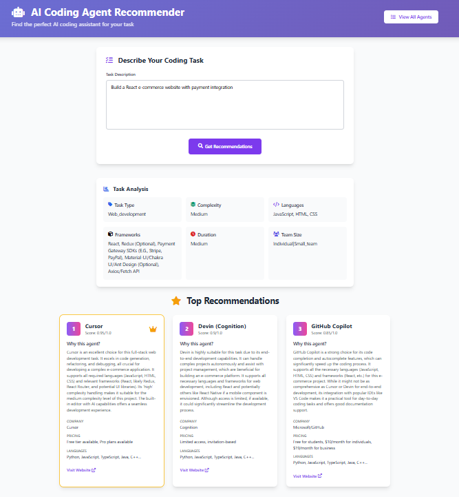
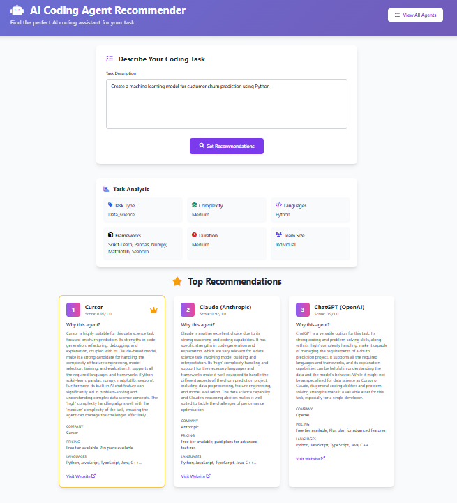
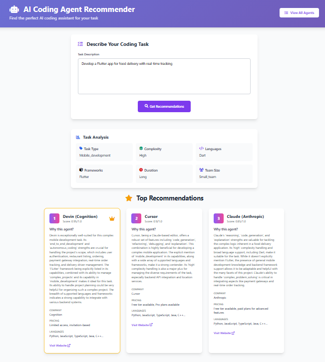

# AI Coding Agent Recommender

An intelligent system that recommends the best coding agents for given tasks using Gemini 2.0 Flash for natural language understanding and analysis.

## 🚀 Features

- **Natural Language Task Input**: Accepts human-readable task descriptions
- **AI-Powered Analysis**: Uses Gemini 2.0 Flash to analyze task complexity, requirements, and characteristics
- **Intelligent Recommendations**: Recommends top 3 coding agents with detailed justifications
- **Comprehensive Agent Database**: Supports 12+ coding agents including:
  - GitHub Copilot
  - Cursor
  - Replit Ghostwriter
  - Amazon CodeWhisperer
  - Claude (Anthropic)
  - ChatGPT (OpenAI)
  - Devin (Cognition)
  - Windsurf
  - Perplexity
  - Codeium
  - Tabnine
  - Kite

## 🛠️ Technology Stack

- **Backend**: Flask (Python)
- **AI Engine**: Google Gemini 2.0 Flash
- **Frontend**: HTML, CSS, JavaScript
- **Data Storage**: JSON-based agent knowledge base

## 📋 Prerequisites

- Python 3.8 or higher
- Google AI Studio API key for Gemini 2.0 Flash

## 🚀 Installation & Setup

### 1. Clone the Repository
```bash
git clone <repository-url>
cd q2_agent_recommender
```

### 2. Install Dependencies
```bash
pip install -r requirements.txt
```

### 3. Set Up API Key
You need a Google AI Studio API key to use Gemini 2.0 Flash.

1. Go to [Google AI Studio](https://makersuite.google.com/app/apikey)
2. Create a new API key
3. Set the environment variable:

**Windows:**
```cmd
set GOOGLE_API_KEY=your_api_key_here
```

**macOS/Linux:**
```bash
export GOOGLE_API_KEY=your_api_key_here
```

**Or create a `.env` file:**
```
GOOGLE_API_KEY=your_api_key_here
```

### 4. Run the Application
```bash
python app.py
```

The application will be available at `http://localhost:5000`

## 📖 Usage

### Web Interface

1. **Open the Application**: Navigate to `http://localhost:5000`
2. **Enter Task Description**: Describe your coding task in natural language
3. **Get Recommendations**: View AI-analyzed task characteristics and top 3 agent recommendations
4. **Browse Agents**: Visit `/agents` to see all available agents and their capabilities

### API Endpoints

#### Get Recommendations
```bash
POST /recommend
Content-Type: application/json

{
    "task_description": "Build a React e-commerce website with payment integration"
}
```

**Response:**
```json
{
    "success": true,
    "task_analysis": {
        "task_type": "web_development",
        "complexity": "medium",
        "languages": ["JavaScript", "TypeScript"],
        "frameworks": ["React", "Stripe"],
        "estimated_duration": "medium",
        "team_size": "individual",
        "key_requirements": ["payment integration", "e-commerce"],
        "domain": "web"
    },
    "recommendations": [
        {
            "rank": 1,
            "agent_name": "Cursor",
            "score": 0.92,
            "justification": "Excellent for React development with strong code generation capabilities...",
            "agent_info": { ... }
        }
    ]
}
```

#### Get All Agents
```bash
GET /api/agents
```

## 📝 Usage Examples

### Example 1: Web Development
**Task**: "Build a React e-commerce website with payment integration"

**Analysis**:
- Task Type: web_development
- Complexity: medium
- Languages: JavaScript, html, css
- Frameworks: React, Redux (optional), Payment Gateway SDKs (e.g., Stripe, PayPal), Material-UI/Chakra UI/Ant Design (optional), Axios/Fetch API
- Duration: medium
- Team size: individual|small_team

**Top Recommendations**:
1. **Cursor** (Score: 0.95) - Excellent for React development with strong code generation
2. **Devin Cognition** (Score: 0.9) - Great for general web development and code completion
3. **Claude** (Score: 0.85) - Strong reasoning for complex integrations



### Example 2: Data Science
**Task**: "Create a machine learning model for customer churn prediction using Python"

**Analysis**:
- Task Type: data_science
- Complexity: high
- Languages: Python
- Frameworks: scikit-learn, pandas, numpy, matplotlib, seaborn
- Duration: medium
- Team size: individual

**Top Recommendations**:
1. **Cursor** (Score: 0.95) - Excellent for complex ML tasks and reasoning
2. **Claude** (Score: 0.92) - Strong in data science and problem-solving
3. **ChatGpt** (Score: 0.9) - Python-focused with ML capabilities



### Example 3: Mobile Development
**Task**: "Develop a Flutter app for food delivery with real-time tracking"

**Analysis**:
- Task Type: mobile_development
- Complexity: high
- Languages: Dart
- Frameworks: Flutter
- Duration: long
- Team size: small_team

**Top Recommendations**:
1. **Devin** (Score: 0.95) - Excellent for complex mobile development
2. **Cursor** (Score: 0.9) - End-to-end development capabilities
3. **Claude** (Score: 0.85) - Good for general development tasks



## 🏗️ Project Structure

```
q2_agent_recommender/
├── app.py                 # Main Flask application
├── recommendation_engine.py  # Gemini 2.0 Flash integration
├── agent_database.py      # Agent data management
├── agents_db.json         # Agent knowledge base
├── requirements.txt       # Python dependencies
├── README.md             # This file
├── demo/                 # Screenshots and examples
└── templates/            # HTML templates
    ├── index.html        # Main interface
    └── agents.html       # Agent database view
```

## 🔧 Configuration

### Environment Variables

- `GOOGLE_API_KEY`: Required for Gemini 2.0 Flash API access

### Customizing Agent Database

Edit `agents_db.json` to add or modify coding agents:

```json
{
    "name": "Agent Name",
    "description": "Brief description",
    "company": "Company Name",
    "model": "AI Model Used",
    "strengths": ["strength1", "strength2"],
    "capabilities": ["capability1", "capability2"],
    "languages": ["Python", "JavaScript"],
    "frameworks": ["React", "Django"],
    "complexity_handling": "high|medium|low",
    "system_prompt": "Agent's system prompt",
    "pricing": "Pricing information",
    "website": "Official website",
    "integration": "Integration details"
}
```


### Fallback Mode

The system includes fallback mechanisms that work even if Gemini API is unavailable, using rule-based scoring algorithms.


