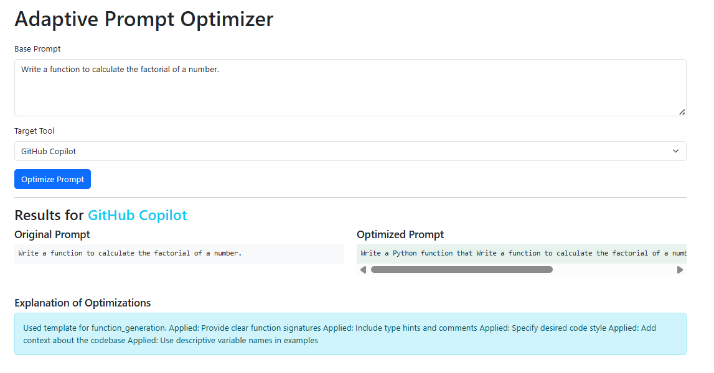
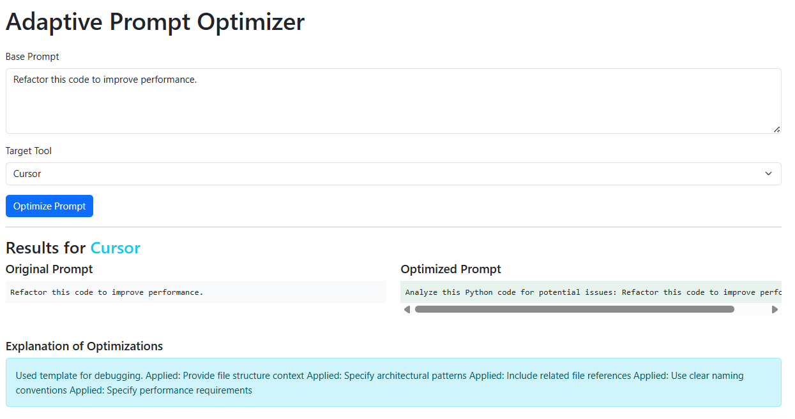
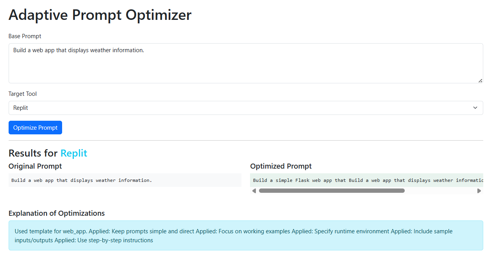

# Adaptive Prompt Optimizer

A web tool to optimize prompts for specific AI coding tools (Copilot, Cursor, Replit, CodeWhisperer, Tabnine, Kite, etc.).

## Features
- Accepts a base prompt and target tool selection
- Analyzes prompt intent, complexity, and requirements
- Generates optimized prompts based on tool-specific strategies
- Displays before/after comparison with explanations
- Supports 6+ popular AI coding tools

## Setup Instructions

1. **Install dependencies**

```bash
cd q3_adaptive_prompt_optimizer
pip install flask
```

2. **Run the app**

```bash
python app.py
```

3. **Open in your browser**

Go to [http://127.0.0.1:5000/](http://127.0.0.1:5000/)

## Example Usages

### Example 1: Copilot - Function Generation
- **Base Prompt:** `Write a function to calculate the factorial of a number.`
- **Tool:** GitHub Copilot
- **Optimized Prompt:**
  > Write a Python function that Write a function to calculate the factorial of a number.. Include proper error handling and documentation.
- **Explanation:**
  > Used template for function_generation.
  > Applied: Provide clear function signatures, Include type hints and comments, Specify desired code style, Add context about the codebase, Use descriptive variable names in examples



### Example 2: Cursor - Refactoring
- **Base Prompt:** `Refactor this code to improve performance.`
- **Tool:** Cursor
- **Optimized Prompt:**
  >Analyze this Python code for potential issues: Refactor this code to improve performance.
- **Explanation:**
  > Used template for refactoring.
  > Applied: Provide file structure context, Specify architectural patterns, Include related file references, Use clear naming conventions, Specify performance requirements



### Example 3: Replit - Web App
- **Base Prompt:** `Build a web app that displays weather information.`
- **Tool:** Replit
- **Optimized Prompt:**
  > Build a simple Flask web app that Build a web app that displays weather information.. Include HTML, CSS, and JavaScript.
- **Explanation:**
  > Used template for web_app.
  > Applied: Keep prompts simple and direct, Focus on working examples, Specify runtime environment, Include sample inputs/outputs, Use step-by-step instructions



---

You can extend the tool by adding more optimizers in the `optimizers/` directory and updating `tool_analysis.json`.

